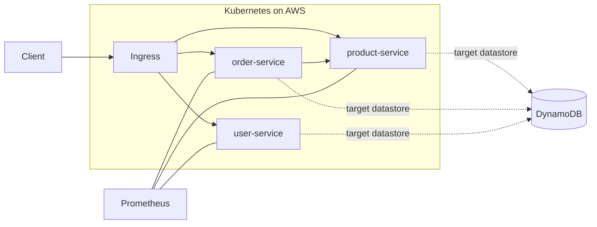

# ShopStack DevOps

DevOps repository for **ShopStack** — an e-commerce platform modernization effort focused on **migrating from a monolithic application to microservices** and delivering a production-grade, cost-aware platform on **AWS + Kubernetes**.

---

## Architecture 

### High-level overview

- **Platform goal:** Break down a monolith into independently deployable **microservices** with updated service layers and modern delivery practices.
- **Runtime:** **Kubernetes** (on **AWS**)
- **GitOps delivery:** **Argo CD** (sync from Git)
- **CI:** **GitHub Actions**
- **Data layer:** **Amazon DynamoDB** (target/primary in the modernization plan)
- **Observability:** **Prometheus**
- **Non-functional priorities:** **Cost optimization** and **autoscaling**

### What’s in this repo (folder map)

- `microservices/` — application microservices (Dockerized)
  - `product-service/` (Flask; exposes `/products`)
  - `order-service/` (Flask; exposes `/orders`, calls product-service)
  - `user-service/` (Flask; exposes `/users`)
- `monolith/` — monolithic baseline service (used for migration reference)
- `k8s/` — Kubernetes manifests
  - `k8s/microservices/` — Deployments/Services per microservice
  - `k8s/monolith/` — monolith Kubernetes deployment
  - `k8s/ingresss/ingress.yaml` — Ingress routing for `/products`, `/orders`, `/users`
  - `k8s/storage/` — PV/PVC manifests used by services (local hostPath examples)
- `scripts/` — helper scripts (e.g., build scripts)

> Note: Some current microservice examples use JSON files mounted via PV/PVC for simplicity. In the target architecture, service state should be externalized to managed stores (e.g., DynamoDB) where appropriate.

### Request routing (as implemented in manifests)

- **Ingress routes**
  - `/products` → `product-service`
  - `/orders` → `order-service`
  - `/users` → `user-service`

### Service-to-service communication

- `order-service` calls `product-service` to validate `product_id` before creating an order.

### Architecture diagram (Mermaid)



---

## CI/CD

- **CI:** GitHub Actions (build/test/package)
- **CD:** Argo CD (GitOps reconciliation into Kubernetes)

Typical flow:

1. Push code → GitHub
2. GitHub Actions runs CI and builds artifacts
3. Manifests/config in Git are updated
4. Argo CD syncs changes to the cluster

---

## Deploy (local K8s example)

> Commands may vary depending on your cluster and whether images are built/pushed to a registry. Some manifests currently use `imagePullPolicy: Never`.

```bash
kubectl apply -f k8s/storage/
kubectl apply -f k8s/microservices/
kubectl apply -f k8s/ingresss/ingress.yaml
```

---

## Resume-ready project summary

**ShopStack DevOps (AWS, Kubernetes, GitHub Actions, Argo CD, DynamoDB, Prometheus)**

- Drove migration from a monolithic architecture to **microservices**, enabling independent deployments and faster release cycles.
- Implemented CI with **GitHub Actions** and GitOps-based CD with **Argo CD**, deploying containerized services to **Kubernetes on AWS**.
- Defined Kubernetes **Ingress-based routing** and service-to-service communication patterns (e.g., order-service → product-service).
- Established **Prometheus monitoring** and applied **autoscaling/cost-focused** practices to balance reliability, performance, and cloud spend.

---

## Next improvements (recommended)

- Replace local PV/JSON persistence with **DynamoDB integration** per service and document table design + IAM permissions.
- Add **HPA** manifests and resource requests/limits for predictable autoscaling.
- Add a `/.github/workflows/` section once workflows are present (or link them here).
- Add Argo CD `Application` manifests (or link them) and document environment promotion (dev → stage → prod).
